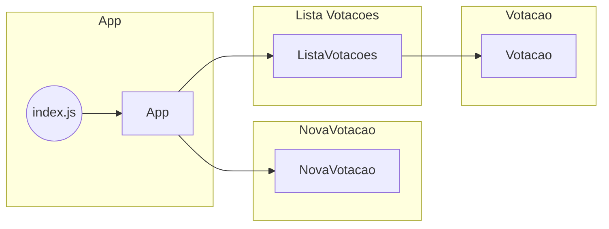
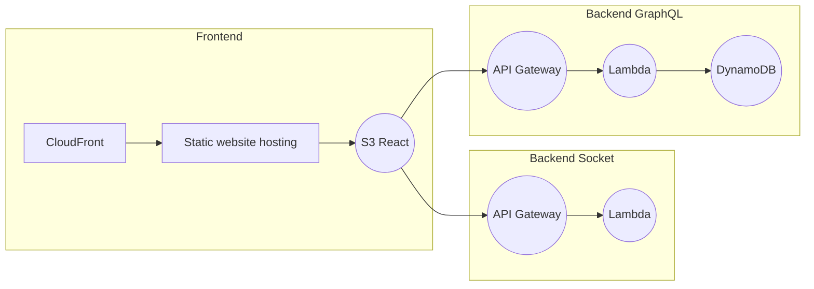

# Sistema de votação ao vivo para enquetes

Alunos:
* Diogo Passos Perdigão Britto
* Juliano Caetano


Url publica: https://d118x8uh80u26v.cloudfront.net/


Objetivo: Os alunos devem trabalhar em grupos de três para documentar uma aplicação desenvolvida com as tecnologias Serverless, GraphQL e WebSockets. A atividade envolve a criação de documentação usando diferentes abordagens, como Swagger para a API, uma visão geral da arquitetura, um diagrama de componentes e uma seção de boas práticas.

Passo a passo:

# Documentação 1, 2: Diagrama de Componentes
1. Os grupos devem analisar a arquitetura existente da aplicação e identificar os componentes principais.
2. Com base na arquitetura identificada, os grupos devem criar um diagrama de componentes que ilustre o relacionamento entre eles.


Este diagrama de componentes ilustra a estrutura do projeto e a relação entre os diferentes componentes.
## Aplicação Front

# Diagrama Arquitetural
3. Os grupos devem criar uma documentação de visão geral da arquitetura, descrevendo a finalidade da aplicação, os principais componentes e a interação entre eles.

A aplicação é um sistema simples de votação que registra os dados em um dynamodb. Além disso tem integração com um sistema de socket para a funcionalidade de tempo real dos votos.


## API GraphQL Documentation
4. Utilizando a especificação do GraphQL, os grupos devem criar uma documentação no formato API GraphQL, incluindo os tipos de consulta disponíveis, os parâmetros esperados e os dados retornados.


A API GraphQL é utilizada para interagir com o backend da aplicação de votação.

### Types

#### Votacao

Representa uma votação individual.

- **Fields:**
  - `id` (ID): O ID da votação.
  - `titulo` (String): O título da votação.
  - `opcoes` ([String]): Uma lista de opções de voto disponíveis na votação.

### Queries

#### getVotacao(id: ID!)

Obtém os detalhes de uma votação específica com base no ID fornecido.

- **Parâmetros:**
  - `id` (ID): O ID da votação desejada.

- **Retorno:**
  - `votacao` (Votacao): Os detalhes da votação correspondente ao ID fornecido.

### Mutations

#### criarVotacao(titulo: String!, opcoes: [String!]!)

Cria uma nova votação com o título e as opções fornecidas.

- **Parâmetros:**
  - `titulo` (String): O título da votação.
  - `opcoes` ([String!]): Uma lista de opções de voto disponíveis na votação.

- **Retorno:**
  - `votacao` (Votacao): Os detalhes da votação recém-criada.

#### registrarVoto(id: ID!, opcao: String!)

Registra um voto em uma votação específica.

- **Parâmetros:**
  - `id` (ID): O ID da votação na qual o voto será registrado.
  - `opcao` (String): A opção escolhida para o voto.

- **Retorno:**
  - `votacao` (Votacao): Os detalhes atualizados da votação após o voto ser registrado.

## Swagger
5. A API Serverless também deve ser documentada utilizando Swagger e Open API.

```swagger
	swagger: "2.0"
	info:
	title: Votacao WebSocket API
	version: "1.0.0"
	host: d03zju3xta.execute-api.sa-east-1.amazonaws.com
	schemes:
	- https
	paths:
	/production:
		post:
		summary: Enviar mensagem para conexões WebSocket
		consumes:
			- application/json
		produces:
			- application/json
		parameters:
			- in: body
			name: body
			description: Corpo da mensagem
			required: true
			schema:
				$ref: "#/definitions/MessageBody"
		responses:
			"200":
			description: Sucesso
			"400":
			description: Requisição inválida
			"500":
			description: Erro interno do servidor
	definitions:
	MessageBody:
		type: object
		properties:
		connectionId:
			type: string
			description: ID da conexão WebSocket
		body:
			type: object
			description: Corpo da mensagem
```

# Boas Práticas de Desenvolvimento
6. Os grupos devem elaborar uma seção de boas práticas de desenvolvimento para a aplicação, abordando questões como segurança, escalabilidade, monitoramento e melhores práticas de codificação.

# Segurança
* Embora não implementamos por uma questão de custos poderiamos usar, mecanismos de proteção contra ataques de força bruta e negação de serviço, limitando as tentativas de login e utilizando serviços de proteção como o AWS WAF (Web Application Firewall).

* Frontend tanto quanto o backend estão protegidos por protocolos https e wss.

# Escalabilidade
* Utilizamos a arquitetura serverless para nossa aplicação, hospedando nossos endpoints GraphQL e WebSocket no AWS Lambda. Isso nos permite dimensionar automaticamente a capacidade conforme o volume de tráfego, sem a necessidade de gerenciar servidores. Exemplo: Utilizamos o serviço AWS Lambda para implementar nossas funções de resolvers GraphQL e handlers de eventos WebSocket.
* Armazenamos nossos dados em um banco de dados NoSQL altamente escalável, como o Amazon DynamoDB. Isso nos permite lidar com um grande número de registros de votação de forma eficiente. Exemplo: Utilizamos a biblioteca aws-sdk para interagir com o DynamoDB e executar operações de leitura e gravação.
* Utilizamos o Amazon S3 para hospedar nosso aplicativo front-end estático, garantindo escalabilidade e alta disponibilidade. Exemplo: Utilizamos o serviço AWS S3 para armazenar e distribuir nossos arquivos JavaScript, CSS e imagens.

# Monitoramento
* Configuramos alertas e métricas personalizadas utilizando o Amazon CloudWatch para monitorar o desempenho da nossa aplicação. Por exemplo, monitoramos o número de votos por segundo, a latência das requisições e a taxa de erros. Quando um alerta é acionado, recebemos notificações para que possamos investigar e resolver problemas o mais rápido possível. Exemplo: Configuramos alarmes no CloudWatch para notificar nossa equipe sempre que a taxa de erros das nossas funções Lambda ultrapassar um determinado limiar.
 
# Melhores Práticas de Codificação
* Seguimos as melhores práticas de codificação, como utilizar nomes de variáveis e funções descritivas, manter um código bem formatado e modularizado, e aplicar princípios de design de software como a separação de preocupações (SoC) e o princípio da responsabilidade única (SRP). Exemplo: Utilizamos a convenção de nomenclatura camelCase para nossas variáveis e funções, e estruturamos nosso código em módulos reutilizáveis.

* Utilizamos um sistema de controle de versão, como o Git, para gerenciar o código-fonte da nossa aplicação. Isso nos permite rastrear e controlar as alterações feitas no código ao longo do tempo, além de facilitar a colaboração entre os membros da equipe.

* Documentamos nosso código de forma clara e concisa, incluindo comentários relevantes e explicativos. Também mantemos uma documentação externa atualizada para facilitar a compreensão e o uso da nossa aplicação por outros desenvolvedores.

* Além de um readme.md bem explicativo e extensivo, com visões arquiteturais e diagramas diversos.

# Apresentação
7. Cada grupo deve apresentar sua documentação para a turma, destacando os pontos-chave e as decisões tomadas ao longo do processo de documentação.

8. Após as apresentações, os grupos devem ter a oportunidade de fazer perguntas e discutir as diferentes abordagens utilizadas na documentação.

Link do Video apresentando o sistema: